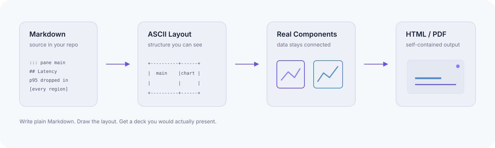

<picture>
  <source media="(prefers-color-scheme: dark)" srcset="docs/brand/mirzam-wordmark-dark.svg">
  
</picture>

**Presentation decks that live in your repository.** Write plain Markdown, draw the
layout as ASCII, and get a deck with real charts, diagrams, video and math — as a
single HTML file or a PDF.

> Mirzam (β Canis Majoris) — "the announcer", the star that rises before Sirius.

**[See the decks running →](https://ayatough.github.io/Mirzam/)**

[Quick start](docs/quickstart.md) · [Syntax](docs/syntax.md) · [Syntax card](docs/llms.md) · [Layout guide](docs/layout.md) · [Troubleshooting](docs/troubleshooting.md) · [Architecture](docs/architecture.md) · [Roadmap](docs/roadmap.md) · [Contributing](CONTRIBUTING.md) · [Development](docs/development.md) · [Brand](docs/brand/README.md) · [Agents](AGENTS.md) · [日本語](docs/ja/README.md)

<a href="https://www.buymeacoffee.com/qython" target="_blank"></a>

---

## Why

Slide tools make you choose. WYSIWYG editors give you control but produce opaque
binaries that no one can review. Markdown slide tools are diffable but leave you
with one column and a title. Mirzam is an attempt at both: the source is ordinary
Markdown that renders fine on GitHub, and the output is a deck you would actually
present.

````markdown
```pane
+------------------+-----------------+
|  head                              |
+------------------+-----------------+
|                  |                 |
|  main            |  chart          |
|                  |                 |
+------------------+-----------------+
```

::: pane head
## Latency after the cache rollout
:::

::: pane main
p95 dropped in [every region]{#win .u}, with the largest win in `ap-ne`.
:::

::: pane chart
```chart
type: bar
id: latency
data: |
  region, before, after
  us-east, 210, 120
  ap-ne, 380, 180
```
:::

```connect
#win -> #latency-1-2 : color=@accent2
```
````

The layout is the box drawing. The chart comes from the data next to it. The arrow
points from a phrase in the sentence to an individual bar, and re-routes itself
whenever the layout changes.

## How it works

<picture>
  <source media="(prefers-color-scheme: dark)" srcset="docs/brand/mirzam-concept-workflow-dark.svg">
  
</picture>

Four stages, all at build time. Nothing in the output phones home: the charts are
SVG, the math is MathML, the images are inlined, and the deck is one file you can
email.

## Features

| | |
|---|---|
| **Layout you can see** | Draw panes as ASCII; column widths and row heights follow what you drew |
| **Charts from data** | `chart` blocks read inline CSV or a `.csv` file and render SVG at build time |
| **Diagrams that stay linked** | `shape` blocks draw boxes; `connect` blocks point from text to any element, resolved live |
| **Math** | LaTeX converted to MathML at build time — no client-side JavaScript |
| **Annotations** | Circle, box, label and point at part of a photo or a single chart bar; the marks reach the PDF |
| **Pairing, not arrows** | Mark a phrase and the bar it refers to on the same click, in one colour — nothing crosses the slide |
| **Effects on a key** | Flash, shake, speed lines, confetti, danmaku — fired while presenting, never in the export |
| **Animation** | `anim` blocks compile to a timeline: entrances, click-through builds, page turns — and the PDF still shows every slide revealed |
| **Video, audio and embeds** | Files inlined; YouTube and Vimeo embedded, with a link in the PDF |
| **Citations** | `[^key]` footnotes land at the foot of the slide that cites them |
| **References** | `[@key]` against a BibTeX file; the `bibliography` block lists what was cited, links each mark to it and each entry back to the slides that cited it |
| **A contents page that writes itself** | `toc` collects the deck's headings, links each to its slide, and marks the section you are in |
| **Nothing silently lost** | `fit: shrink` scales an overfull pane down instead of clipping it |
| **Your break, not the box's** | `<!-- next -->` carries one pane on to the next slide while the rest hold still |
| **Backgrounds that stay readable** | A photo behind a pane, with `dim`, `blur` and gradient `scrim` so the text still wins |
| **Files that scale** | Split a deck across files with `![[section.md]]`; only edited slides re-render |
| **Runs anywhere** | One Rust core, compiled to a native CLI and to WebAssembly for editors and browsers |
| **Still Markdown** | Every extension degrades to harmless code blocks in a plain CommonMark parser — enforced by a test |

## Install

**No install needed to try it:** the [browser
editor](https://ayatough.github.io/Mirzam/try/) runs the same Rust core as
WebAssembly and hands you the finished `.html`. It works on a phone.

For live preview, PDF export, file splitting and local images you want the CLI.
No Rust toolchain required — the
[releases page](https://github.com/ayatough/Mirzam/releases) has a binary for
macOS, Linux and Windows:

```bash
curl -fsSL https://raw.githubusercontent.com/ayatough/Mirzam/main/scripts/install.sh | sh
```

That puts `mirzam` in `~/.local/bin`. On Windows, download the `.zip` from the
releases page. See the [quick start](docs/quickstart.md) for every other way in
— VS Code, Obsidian, the browser.

To build it yourself instead, you need Rust 1.91 or newer:

```bash
git clone https://github.com/ayatough/Mirzam
cd Mirzam
cargo build --release
```

That leaves the binary at `./target/release/mirzam`. It is **not** on your `PATH`
— run it by that path, or install it:

```bash
cargo install --path crates/mirzam-cli --bin mirzam   # into ~/.cargo/bin
```

## Use

The examples below assume `mirzam` is on your `PATH`. If you only ran
`cargo build --release`, write `./target/release/mirzam` instead.

```bash
mirzam new deck.md                   # a deck to start from (--empty for a blank file)
mirzam build deck.md -o out          # single self-contained HTML
mirzam build README.md --split h2    # any document becomes a deck, unedited
mirzam serve deck.md                 # live preview at localhost:4321
mirzam export pdf deck.md -o deck.pdf
mirzam check deck.md                 # clipped panes, unresolved connectors, and the rest
```

In the viewer: `←` `→` to navigate (and to step through a slide's animation),
`N` for speaker notes, `F` for fullscreen, `D` for dark mode, `L` to outline the
layout, `P` for a presenter window with the next slide, your notes and a timer.
Press `/` for the full list, including the effect keys this particular deck
binds. On a phone, swipe to turn the page, swipe up for notes, and two-finger
tap for the same sheet — the long press is left alone, because that is how you
select text.

A slide that doesn't fit, markup that shows up as literal text, or a build
warning you don't recognise — see [docs/troubleshooting.md](docs/troubleshooting.md).

### In your editor

```bash
./scripts/build-vsix.sh
code --install-extension editors/vscode/mirzam-preview-*.vsix
```

Open a `.md` file and press `Ctrl+K V` (`Cmd+K V` on macOS). Editing re-renders only
the slide you touched, and moving the cursor scrolls the preview to match.

### In a browser

The published editor is at
**[ayatough.github.io/Mirzam/try](https://ayatough.github.io/Mirzam/try/)** —
write, preview, and download the finished deck, with no toolchain at all. To run
that same page against your working copy:

```bash
./scripts/serve-wasm-demo.sh    # http://localhost:8080
```

## Examples

**Start here** — [`examples/01-start.md`](examples/01-start.md): the smallest file
that works, where a page breaks, and the three commands, in six slides.

**The markup, deck by deck.** Not a path to walk, a reference to look things up
in — each covers one area and is written in the markup it documents, so the
source beside the slides is the example.

| Deck | Covers |
|---|---|
| [`examples/02-writing.md`](examples/02-writing.md) | Headings, emphasis, lists, tables, maths, footnotes, emoji |
| [`examples/03-layout.md`](examples/03-layout.md) | Layout rules, one per slide — the companion to [docs/layout.md](docs/layout.md) |
| [`examples/04-components.md`](examples/04-components.md) | Charts, shapes, connectors, media and annotations, beside their source |
| [`examples/05-motion.md`](examples/05-motion.md) | Animation: entrances, click-through builds, page turns, presentation effects |
| [`examples/06-theming.md`](examples/06-theming.md) | Themes, every frontmatter field, attributes, custom CSS |

**Whole decks**, written for an audience rather than as documentation:

| Deck | What it is |
|---|---|
| [`examples/pitch.md`](examples/pitch.md) | A sales pitch: metric tiles, charts from CSV, a custom dark theme |
| [`examples/research.md`](examples/research.md) | A research report: maths, a chart, and a bibliography cited from four slides |
| [`examples/seminar.md`](examples/seminar.md) | The same shape in Japanese: maths, a quoted figure, footnotes beside a cited bibliography, CJK typography |

```bash
cargo run --bin mirzam -- build examples/01-start.md -o out && open out/index.html
```

Every one of them is published, built by Mirzam itself, at
**[ayatough.github.io/Mirzam](https://ayatough.github.io/Mirzam/)** — including
this README, rendered as a deck with `--split h2` and no Mirzam syntax at all.
Run `./scripts/build-site.sh` to build the same site locally.

## Status

`v0.4.0` is the current release, covered by regression tests in CI. It is
`0.x`: the markup will keep changing, so pin a version if you depend on it.

- **Working:** build, live-reload server, PDF export, ASCII pane layout, slide
  masters, file splitting, variables and arithmetic, math in LaTeX or Typst
  flavour, charts, shapes, live connectors, video, audio and embeds, citations,
  references from a BibTeX file, background images, animation and slide
  transitions, annotations, effects, shrink-to-fit and author-chosen pane
  breaks, named themes and dark mode down to a single pane, custom themes,
  footers and slide numbers, speaker notes and a presenter window, touch and
  gesture controls, a table of contents from headings, VS Code extension,
  WebAssembly core and a browser editor
- **Next:** carrying an element from one slide to the next, dragging an
  annotation back into the Markdown, PowerPoint export
- **Performance:** a 500-slide deck builds in 76 ms; a single-slide edit
  re-renders in 3.2 ms

See the [roadmap](docs/roadmap.md) for the full plan and [development
guide](docs/development.md) to work on it.

## How this repository is developed

**`main` is the working branch, not a stable one.** Development happens on it
directly: this is a single author working with an AI assistant, so a pull
request has no second reader to wait for, and holding changes on a branch only
delays the one review that does happen — looking at the deployed site.

The site is [published in two channels](.github/workflows/pages.yml) so that
landing a change and releasing it stay separate things:

| | Built from | For |
|---|---|---|
| **[ayatough.github.io/Mirzam](https://ayatough.github.io/Mirzam/)** | the latest release tag | anyone arriving from a link |
| **[/next/](https://ayatough.github.io/Mirzam/next/)** | the tip of `main` | seeing a change before it is released |

`/next/` says which commit it is and lists the changelog's unreleased entries.
It is a working copy — take it as a preview, not a promise.

What that means if you are using Mirzam:

- **Depend on a [release](https://github.com/ayatough/Mirzam/releases), not on
  `main`.** Tags are the stable points. `main` can carry a half-finished
  feature, markup that is about to change again, or a fix that has not been
  looked at on a real screen yet.
- **The gate still runs on every push**: tests, clippy, formatting, the layout
  check and the WASM build, on `main` as well as on pull requests. `main` being
  the working branch does not mean it is allowed to be broken — it means it is
  allowed to change under you.
- **Bug reports against `main` are welcome**; say which commit, since there may
  not be a version number to name.

Contributions still go through pull requests — see
[CONTRIBUTING.md](CONTRIBUTING.md). The direct-push policy is about the author's
own commits, not a closed door.

## Contributing

**Bug reports and feature requests are very welcome** — a deck is a text file, so
a bug report can usually be the deck. For code, please read
[CONTRIBUTING.md](CONTRIBUTING.md) first: small fixes are fine to send straight
in, but anything with a design decision in it wants an issue first, because the
syntax is the expensive part to get wrong.

## License

MIT. The bundled STIX Two Math font is licensed under the SIL Open Font License.
