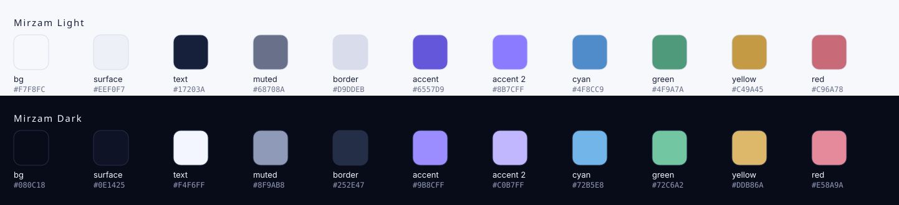

# Mirzam palette

Mirzam Light and Mirzam Dark take the *role* structure of Solarized and Nord — a
fixed set of named slots, so a theme can be swapped without rewriting anything
that uses it — rather than their colours. The values below are the ones in
[`mirzam-theme.css`](mirzam-theme.css).

## Mirzam Light

| Token | Hex | Variable |
|---|---|---|
| background | `#F7F8FC` | `--mirzam-bg` |
| surface | `#EEF0F7` | `--mirzam-surface` |
| text | `#17203A` | `--mirzam-text` |
| muted | `#68708A` | `--mirzam-muted` |
| border | `#D9DDEB` | `--mirzam-border` |
| accent | `#6557D9` | `--mirzam-accent` |
| accent 2 | `#8B7CFF` | `--mirzam-accent-2` |
| cyan | `#4F8CC9` | `--mirzam-cyan` |
| green | `#4F9A7A` | `--mirzam-green` |
| yellow | `#C49A45` | `--mirzam-yellow` |
| red | `#C96A78` | `--mirzam-red` |

## Mirzam Dark

| Token | Hex | Variable |
|---|---|---|
| background | `#080C18` | `--mirzam-bg` |
| surface | `#0E1425` | `--mirzam-surface` |
| text | `#F4F6FF` | `--mirzam-text` |
| muted | `#8F9AB8` | `--mirzam-muted` |
| border | `#252E47` | `--mirzam-border` |
| accent | `#9B8CFF` | `--mirzam-accent` |
| accent 2 | `#C0B7FF` | `--mirzam-accent-2` |
| cyan | `#72B5E8` | `--mirzam-cyan` |
| green | `#72C6A2` | `--mirzam-green` |
| yellow | `#DDB86A` | `--mirzam-yellow` |
| red | `#E58A9A` | `--mirzam-red` |

## How to spend them

**Violet is the signature and nothing else is.** Accent and accent 2 mark the one
thing on a page that should be looked at first — a link, the primary button, the
connector that carries the argument. Two violets rather than one, so a highlight
can sit on top of a highlight without either disappearing.

**Cyan, green, yellow and red are reserved for meaning.** Chart series, pass and
fail, warnings, annotation marks. Once yellow has been spent on a decorative
divider somewhere, a yellow bar in a chart no longer says anything — which is the
whole reason a deck tool has a fixed palette.

**Muted is for text, border is for lines.** They sit close together in the light
theme and far apart in the dark one, deliberately: a hairline has to survive on
`#080C18` without turning into a glow.

## Contrast

Measured, not assumed (WCAG 2.1 contrast ratio; AA wants 4.5:1 for body text):

| Pair | Light | Dark |
|---|---|---|
| text on background | 15.2:1 | 18.1:1 |
| muted on background | 4.6:1 | 7.0:1 |
| muted on surface | **4.3:1** | 6.5:1 |
| accent on background | 5.1:1 | 7.1:1 |
| accent on surface | 4.7:1 | 6.6:1 |

Two things follow. Muted text on a surface in the light theme is the one pair
that misses AA, so put secondary text on `--mirzam-bg`, or use `--mirzam-text` at
a lower opacity inside cards. And the accents clear AA for text everywhere, which
means a link can be violet without a second cue — but they are only just clear of
it, so do not stack accent on surface at 12px.

Border against background is around 1.3:1 in both themes. That is a line, not
text: it is meant to be felt rather than read, and raising it is what makes an
interface look boxed in.
