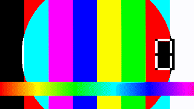
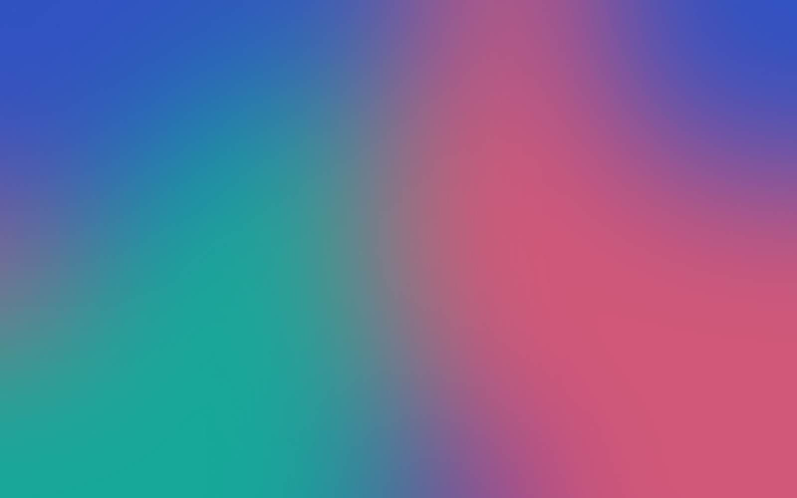

# Component gallery {.title-slide}

Every block on the following slides is plain Markdown. View the source alongside.

<!-- note: This deck doubles as the visual regression sample and the syntax cheat sheet. -->

---

```pane
+------------------------------------+
|                                    |
|  head                              |
+------------------+-----------------+
|                  |                 |
|                  |                 |
|  src             |  out            |
|                  |                 |
|                  |                 |
+------------------+-----------------+
```

::: pane head
[Layout]{.eyebrow}
## The layout *is* the ASCII you draw
:::

::: pane src {.card valign=middle}
```markdown
+----------+----------+
|  head               |
+----------+----------+
|          |          |
|  left    |  right   |
|          |          |
+----------+----------+
```
:::

::: pane out {valign=middle}
- Column widths follow the character widths
- Row heights follow the line counts
- Repeat a name to merge cells
- Nothing to drag; the diff is readable

*Same semantics as CSS Grid areas, so it is predictable.*
:::

---

```pane
+------------------------------------+
|                                    |
|  head                              |
+---------+---------+----------------+
|         |         |                |
|         |         |                |
|  m1     |  m2     |  m3            |
|         |         |                |
|         |         |                |
+---------+---------+----------------+
```

::: pane head
[Components]{.eyebrow}
## Metric tiles
:::

::: pane m1 {.card align=center valign=middle}
<div class="metric metric-up">{{ uptime }}%</div>
<div class="metric-label">uptime, trailing 90 days</div>
:::

::: pane m2 {.card align=center valign=middle}
<div class="metric">{{ regions }}</div>
<div class="metric-label">regions served</div>
:::

::: pane m3 {.card align=center valign=middle}
<div class="metric">{{ regions * 3 }}</div>
<div class="metric-label">availability zones</div>
:::

---

```pane
+------------------------------------+
|                                    |
|  head                              |
+------------------+-----------------+
|                  |                 |
|                  |                 |
|  bars            |  line           |
|                  |                 |
|                  |                 |
+------------------+-----------------+
```

::: pane head
[Charts]{.eyebrow}
## Data in, chart out
:::

::: pane bars
```chart
type: bar
id: latency
title: p95 latency by region (ms)
data: |
  region, before, after
  us-east, 210, 120
  eu-west, 260, 140
  ap-ne, 380, 180
```
:::

::: pane line
```chart
type: line
id: errors
title: Error rate (%)
y_label: "%"
data: |
  week, checkout, search
  W1, 1.8, 0.9
  W2, 1.2, 0.8
  W3, 0.7, 0.6
  W4, 0.4, 0.5
```
:::

<!-- note: Both charts are written as CSV in the slide; no image files involved. -->

---

```pane
+------------------------------------+
|                                    |
|  head                              |
+------------------+-----------------+
|                  |                 |
|                  |                 |
|  text            |  fig            |
|                  |                 |
|                  |                 |
+------------------+-----------------+
```

::: pane head
[Connectors]{.eyebrow}
## Sentences that point at things
:::

::: pane text {valign=middle}
Traffic reaches the [edge cache]{#t-edge .u} first. On a miss it falls through to the [origin]{#t-origin .u}, and only then to the [database]{#t-db .u}.

Move the boxes, resize the window, change the theme - the arrows re-route themselves, because endpoints are resolved from the live layout.
:::

::: pane fig
:::

```shape
rect #edge   at(76%, 26%) size(30%, 13%) label="Edge cache" stroke=@accent2
rect #origin at(76%, 52%) size(30%, 13%) label="Origin"
rect #db     at(76%, 78%) size(30%, 13%) label="Database"
arrow from(#edge.s) to(#origin.n) style=dashed
arrow from(#origin.s) to(#db.n) style=dashed
```

```connect
#t-edge -> #edge.w : color=@accent2
#t-origin -> #origin.w : color=@accent2
#t-db -> #db.w : color=@accent2
```

---

```pane
+------------------------------------+
|                                    |
|  head                              |
+------------------+-----------------+
|                  |                 |
|                  |                 |
|  text            |  fig            |
|                  |                 |
|                  |                 |
+------------------+-----------------+
```

::: pane head
[Shapes]{.eyebrow}
## A diagram that lives in its pane
:::

::: pane text {valign=middle}
The previous slide placed its boxes in page coordinates. This one writes the `shape` block *inside* the `fig` pane, so every percentage is of the pane itself - `at(50%, 12%)` is the top centre of `fig`, wherever the grid puts it.

Resize the pane in the ASCII drawing and the whole diagram follows. Nothing clips at the pane's edges; past 100% is allowed, and deliberate.
:::

::: pane fig
```shape
rect #req  at(50%, 12%) size(64%, 18%) label="Request"
rect #hit  at(26%, 55%) size(40%, 18%) label="Hit" stroke=@accent2
rect #miss at(74%, 55%) size(40%, 18%) label="Miss"
arrow from(#req.s) to(#hit.n)
arrow from(#req.s) to(#miss.n)
text at(50%, 88%) "percentages of the pane, not the page" .small
```
:::

<!-- note: Same DSL as the page-level form; only the coordinate space changes. -->

---

```pane
+------------------------------------+
|                                    |
|  head                              |
+------------------+-----------------+
|                  |                 |
|                  |                 |
|  type            |  math           |
|                  |                 |
|                  |                 |
+------------------+-----------------+
```

::: pane head
[Typography]{.eyebrow}
## Text, tables and math
:::

::: pane type {valign=middle}
**Bold**, *italic*, ~~struck~~, `inline code`, and [links](https://example.com).

> Pull quotes get an accent rule and quieter text.

| Plan | Seats | Price |
|---|---:|---:|
| Team | 8 | $96 |
| Business | 40 | $420 |
| Enterprise | — | Contact |
:::

::: pane math {valign=middle}
Inline math such as $O(1)$ sits in running text.

$$
p_{95} = \mu + 1.645\,\sigma\sqrt{\frac{n}{n-1}}
$$

*Converted to MathML at build time - no client-side JavaScript.*
:::

---

```pane
+------------------------------------+
|                                    |
|  head                              |
+------------------+-----------------+
|                  |                 |
|                  |                 |
|  desc            |  clip           |
|                  |                 |
|                  |                 |
+------------------+-----------------+
```

::: pane head
[Media]{.eyebrow}
## Video is a first-class citizen
:::

::: pane desc {valign=middle}
The image syntax becomes a `<video>` on the file extension alone:

```markdown
{.autoplay .loop .controls}
```

- Flags: `.autoplay`, `.loop`, `.controls`, `.muted`
- `autoplay` implies **`muted`** — browsers block audible autoplay
- In the PDF it becomes its `poster=` frame
- The file is embedded, so one HTML is the whole deck
:::

::: pane clip
{.autoplay .loop .controls poster=media/demo-poster.png fit=contain}
:::

<!-- note: mp4, webm, ogv and mov all work. The samples are webm because a Chromium built without proprietary codecs cannot play H.264. -->

---

```pane
+------------------------------------+
|                                    |
|  head                              |
+------------------+-----------------+
|                  |                 |
|                  |                 |
|  desc            |  clip           |
|                  |                 |
|                  |                 |
+------------------+-----------------+
```

::: pane head
[Media]{.eyebrow}
## A GIF stays a GIF
:::

::: pane desc {valign=middle}
Animated GIFs stay `` elements and loop on their own — there is no
player to configure and no flag to set.

```markdown
{w=90%}
```

The PDF export uses the first frame.
:::

::: pane clip {align=center valign=middle}
{w=90%}
:::

---

```pane
+------------------------------------+
|                                    |
|  head                              |
+------------------+-----------------+
|                  |                 |
|                  |                 |
|  desc            |  clip           |
|                  |                 |
|                  |                 |
+------------------+-----------------+
```

::: pane head
[Media]{.eyebrow}
## Video that lives somewhere else
:::

::: pane desc {valign=middle}
A page URL becomes a player, from where the link says:

```markdown

```

- Served from `youtube-nocookie.com`, fetched when the slide is
  shown — **the one thing here that is not self-contained**
- `{start=1m30s}` overrides the link; `{.autoplay}` and `{.loop}`
  play it on arrival, muted as browsers insist
- The PDF gets the link, timestamp and all
:::

::: pane clip {valign=middle}

:::

<!-- note: This frame is the only thing in the deck that needs the network. The clip is Blender's own open movie, so the sample does not lean on anybody else's video. -->

---

```pane
+------------------------------------+
|                                    |
|  head                              |
+------------------+-----------------+
|                  |                 |
|                  |                 |
|  desc            |  clip           |
|                  |                 |
|                  |                 |
+------------------+-----------------+
```

::: pane head
[Media]{.eyebrow}
## A recording is a player
:::

::: pane desc {valign=middle}
An audio file becomes a player labelled with its alt text:

```markdown

```

- `mp3`, `m4a`, `aac`, `wav`, `ogg`, `opus`, `flac`
- Inlined like any other asset, so the deck is still one file
- `{.autoplay}` starts it **when the slide is shown**, not when
  the deck loads, and leaving the slide stops it
- The PDF keeps the label and drops the transport
:::

::: pane clip {valign=middle}

:::

<!-- note: The sample is a wav because this repository ships no encoder; every format above takes the same path. Press play - autoplay is deliberately not set here, since a gallery deck that makes noise on arrival is a bad neighbour. -->

---

```pane
+------------------------------------+
|                                    |
|  head                              |
+------------------+-----------------+
|                  |                 |
|                  |                 |
|  src             |  hero           |
|                  |                 |
|                  |                 |
+------------------+-----------------+
```

::: pane head
[Backgrounds]{.eyebrow}
## A photo behind the words
:::

::: pane src {.card valign=middle}
```markdown
::: pane hero {bg=media/bg/mountains.jpg
               dim=0.35 blur=2 scrim=bottom}
## Ship the story, not the slide
:::
```

- `dim` darkens the whole photo
- `blur` pushes it out of focus
- `scrim` fades one edge to black
- Text flips to light automatically
:::

::: pane hero {bg=media/bg/mountains.jpg dim=0.3 blur=2 scrim=bottom valign=bottom}
### Ship the story, not the slide

The photo is inlined with everything else, so the deck is still one file.
:::

---

```pane
+------------------+-----------------+
|  head            |  head           |
+------------------+-----------------+
|                  |                 |
|                  |                 |
|  src             |  hero           |
|                  |                 |
+------------------+-----------------+
```

::: pane head
[Backgrounds]{.eyebrow}
## One photo per colour mode
:::

::: pane src {.card valign=middle}
```markdown
::: pane hero {bg-light=art/dawn.webp
               bg-dark=art/night.webp
               text=dark}
### Both are inlined
:::
```

- Both images ship; the deck shows the one that matches
- It follows `D`, not the machine — and a `<picture>` written the GitHub way
  is rewritten into this, so a README keeps its logo
- `text=dark` takes the theme's own ink, which flips with it
:::

::: pane hero {bg-light=../docs/brand/mirzam-hero-light.webp bg-dark=../docs/brand/mirzam-hero-dark.webp text=dark valign=middle}
### Press `D`

The art changes with the deck, not with the laptop.
:::

---

```pane
+----------------------------------------+
|                                        |
|  head                                  |
|                                        |
+---------------------+------------------+
|                     |                  |
|                     |                  |
|                     |                  |
|  shot               |  text            |
|                     |                  |
|                     |                  |
|                     |                  |
+---------------------+------------------+
```

::: pane head
[Annotations]{.eyebrow}
## Circle the thing you are talking about
:::

::: pane shot {valign=middle}
{fit=contain}
:::

::: pane text {valign=middle}
Press `→` twice.

A mark is placed in percentages of the **picture**, and given an id — so the
sentence can point at [the region itself]{#t-hot .u}, not at a spot on the
slide.

```markdown
circle 62,38 34x34 : id=hot step=1
```
:::

```annotate
target: shot
circle 62,38 34x34 : id=hot label="the hot corner" step=1
arrow  16,88 -> 55,48 : step=2
```

```connect
#t-hot -> #hot : color=@accent2
```

<!-- note: The connector's endpoint is drawn by the annotation overlay, so it only exists once the marks do - and it arrives with them. -->

---

```pane
+----------------------------------------+
|                                        |
|  head                                  |
|                                        |
+------------------+---------------------+
|                  |                     |
|  text            |                     |
|                  |  shot               |
|                  |                     |
+------------------+                     |
|  foot            |                     |
+------------------+---------------------+
```

::: pane head
[Annotations]{.eyebrow}
## The same three lines, after you moved everything
:::

::: pane text {valign=middle}
This slide's `annotate` block is **byte for byte the one on the slide before**.
Everything around it changed: the picture swapped sides, took a different
shape, and lost a third of its width.

The circle is still on the same node.
:::

::: pane foot {valign=middle}
[The numbers are not pixels, and that is the point.]{.small}
:::

::: pane shot {valign=middle}
{fit=contain}
:::

```annotate
target: shot
circle 62,38 34x34 : id=hot label="the hot corner" step=1
arrow  16,88 -> 55,48 : step=2
```

<!-- note: Byte for byte the block on the slide before. Nothing in it knows where the pane went. -->

---

```pane
+----------------------------------------+
|                                        |
|  head                                  |
+---------------------+------------------+
|                     |                  |
|                     |                  |
|  bars               |  note            |
|                     |                  |
|                     |                  |
+---------------------+------------------+
```

::: pane head
[Annotations]{.eyebrow}
## A chart mark needs no coordinates
:::

::: pane bars
```chart
type: bar
id: load
title: Requests per node (thousands)
data: |
  node, weekday, weekend
  n-1, 41, 22
  n-2, 38, 24
  n-3, 74, 26
```
:::

::: pane note {valign=middle}
Every chart mark already has an id, so an annotation names one instead of
measuring it. `#load-0-2` is series 0, row 2 — the third node on a weekday.

```markdown
  n-1, 41, 22
  n-2, 38, 24
  n-3, 74, 26

rect #load-0-2 : pad=10 step=1
```
:::

```annotate
target: bars
rect #load-0-2 : pad=10 color=@accent2 label="#load-0-2" step=1
```

<!-- note: The next slide changes two numbers in the CSV. The annotate block is identical. -->

---

```pane
+----------------------------------------+
|                                        |
|  head                                  |
+---------------------+------------------+
|                     |                  |
|                     |                  |
|  bars               |  note            |
|                     |                  |
|                     |                  |
+---------------------+------------------+
```

::: pane head
[Annotations]{.eyebrow}
## Change the numbers; the box follows
:::

::: pane bars
```chart
type: bar
id: load
title: Requests per node (thousands)
data: |
  node, weekday, weekend
  n-1, 77, 22
  n-2, 38, 24
  n-3, 19, 26
```
:::

::: pane note {valign=middle}
**Two numbers changed** in the CSV above, and the `annotate` block did not.
The box is still around `#load-0-2` — which is now the *short* bar, so it
shrank and moved down with it.

```markdown
  n-1, 77, 22
  n-2, 38, 24
  n-3, 19, 26

rect #load-0-2 : pad=10 step=1
```
:::

```annotate
target: bars
rect #load-0-2 : pad=10 color=@accent2 label="#load-0-2" step=1
```

<!-- note: A hand-measured rectangle would now be pointing at empty air. -->
---

```pane
+----------------------------------------+
|                                        |
|  head                                  |
+------------------+---------------------+
|                  |                     |
|                  |                     |
|  prose           |  src                |
|                  |                     |
|                  |                     |
|                  |                     |
+------------------+---------------------+
```

::: pane head
[Annotations]{.eyebrow}
## Point at a phrase, not across the slide
:::

::: pane prose {valign=middle}
An arrow from a sentence to a figure has to leave the text, cross the slide,
and arrive somewhere meaningful.

Marking both ends [at the same moment]{#s-moment}, [in the same colour]{#s-colour},
says it with nothing travelling between them — and it
[survives an edit]{#s-edit} to the sentence.
:::

::: pane src {.card valign=middle}
````markdown
Marking both ends [at the same moment]{#s-moment}

```annotate
highlight #s-moment : step=1
underline #s-colour : step=2
box       #s-edit   : step=3 pad=4
```
````

`highlight`, `underline` and `box` take an `#id`
and nothing else: where the words are is the
browser's business.

No `target:` line: every item is anchored.
:::

```annotate
highlight #s-moment : color=@accent2 step=1
underline #s-colour : color=@accent1 step=2
box       #s-edit   : color=@accent2 step=3 pad=4
```

<!-- note: Three clicks. The underlined phrase wraps, so watch it marked line by line rather than as one box swallowing the gap. -->

---

```pane
+------------------------------------+
|                                    |
|  head                              |
+------------------+-----------------+
|                  |                 |
|                  |                 |
|  src             |  out            |
|                  |                 |
|                  |                 |
+------------------+-----------------+
```

::: pane head
[References]{.eyebrow}
## Cite once, list once
:::

::: pane src {.card valign=middle}
```markdown
Attention replaced recurrence[@vaswani2017],
and the same block pretrains[@devlin2019].

Both are read the way Tufte would
draw them[@tufte2001].
```

Keys come from `refs.bib`, named once in
the frontmatter. `[^key]` is still there for
a remark that belongs to one slide.
:::

::: pane out {valign=middle}
Attention replaced recurrence[@vaswani2017],
and the same block pretrains[@devlin2019].

Both are read the way Tufte would draw them[@tufte2001].

*Each mark jumps to the list on the next slide, and each entry jumps back to
every slide that cited it.*
:::

---

```pane
+------------------------------------+
|                                    |
|  head                              |
+------------------------------------+
|                                    |
|  refs                              |
|                                    |
+------------------------------------+
```

::: pane head
[References]{.eyebrow}
## The list writes itself
:::

::: pane refs
```bibliography
```
:::

<!-- note: Numbered in the order they were first cited. The ↩ after each entry is the slide it was cited on; on this deck they all point back one slide. -->

---

```pane
+------------------------------------+
|                                    |
|  main                              |
|                                    |
+------------------------------------+
|  foot                              |
+------------------------------------+
```

::: pane main {align=center valign=middle}
## That is the whole vocabulary

`pane` · `::: pane` · `chart` · `shape` · `connect` · `annotate` · `bibliography` · attributes · variables

Motion is next door, in `05-motion.md`.
:::

::: pane foot {align=right}
[examples/04-components.md]{.small}
:::
