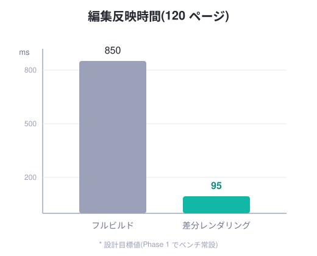

# {{product}} {.title-slide}

Markdown で書く、第三のスライドツール

<!-- note: 自己紹介は 30 秒で切り上げる -->

---

## なぜ作るのか

```pane
+------------------+------------------+
|                  |                  |
|  pain            |  goal            |
|                  |                  |
+------------------+------------------+
```

::: pane pain
**既存ツールの限界**

- レイアウト調整が苦行
- 動画が貼れない
- ページが増えると重い
- 独自記法の学習コスト
:::

::: pane goal
**{{product}} のゴール**

- 見たまま ASCII レイアウト
- HTML ネイティブ = 動画 OK
- ページ単位の差分レンダリング
- CommonMark 互換
:::

---

## 性能目標

```pane
+----------------------------------+
|  head                            |
+---------------------+------------+
|  main               |  fig       |
+---------------------+------------+
```

::: pane head
{{pages}} ページ編集時の反映速度: {{before_ms}}ms → **{{after_ms}}ms**({{round(before_ms / after_ms)}} 倍)
:::

::: pane main
差分レンダリングにより、[変更したスライドだけ]{#inc .u}を再処理する。

数式もそのまま: $T_{update} = O(1)$(デッキサイズに依存しない)
:::

::: pane fig
{fit=contain}
:::

```connect
#inc -> #fig/bar-mirzam : arrow color=@accent1
```

<!-- note: connect ブロックは Phase 2 機能。MVP では「未対応」表示になる -->

---

![[sections/architecture.md]]

---

## まとめ {.center}

**書く・並べる・繋ぐ・動かす** — すべてをテキストで。

```anim
[enter] .center : chars fade-in 400ms stagger=25ms ease=out-cubic
```

<!-- note: anim ブロックは Phase 3 機能 -->
