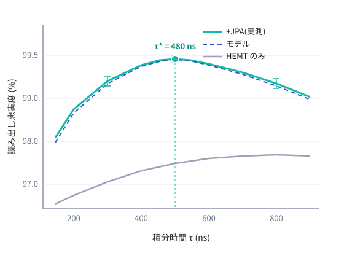
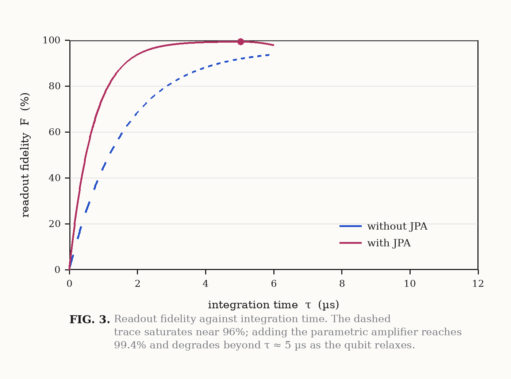

# 超伝導量子ビットにおける<br>分散読み出しの忠実度改善 {.title-slide}

進捗報告 — 量子計測研究室 ゼミ

天狼 星子|2026-08-08

<!-- note: タイトルは 15 秒。前回からの差分がメインだと最初に言う -->

---

```pane
+------------------------------------+
|  head                              |
+------------------------------------+
|                                    |
|                                    |
|  main                              |
|                                    |
|                                    |
+------------------------------------+
```

::: pane head
## 本日の内容
:::

::: pane main {valign=middle}
```toc
from: 2
current: true
```

*所要 15 分 + 質疑 — 各行はそのスライドへのリンク*
:::

---

```pane
+------------------+-----------------+
|  head                              |
+------------------+-----------------+
|                  |                 |
|  main            |  fig            |
|                  |                 |
|                  |                 |
+------------------+-----------------+
```

::: pane head
## 背景: 分散読み出し
:::

::: pane main
- 量子ビットと共振器を**分散結合**させると、量子ビットの状態に応じて共振周波数が $\chi = g^2 / \Delta$ だけシフトする[@dispersive2024]
- このシフトを *マイクロ波の位相変化* として読み取る
- 読み出しの誤りは、そのまま**誤り訂正の閾値**に効いてくる
:::

```shape
ellipse #qubit at(72%, 38%) size(16%, 14%) label="Qubit" stroke=@accent2
rect    #res   at(72%, 68%) size(22%, 14%) label="共振器 λ/4" radius=14
line    from(#qubit.s) to(#res.n) style=dashed
text    at(86%, 53%) "g" .small
```

<!-- note: chi の式は口頭では「分散シフト」とだけ言う。導出は聞かれたら -->

---

```pane
+------------------------------------+
|  head                              |
+------------------------------------+
|                                    |
|  main                              |
|                                    |
+------------------------------------+
|  ref                               |
+------------------------------------+
```

::: pane head
## 課題: 前回までの測定
:::

::: pane main
- 忠実度が **{{f_base}}%** で頭打ち(目標は 99% 以上)
- 誤りの内訳を調べると、~~ゲート誤り~~ ではなく**信号対雑音比(SNR)不足**が支配的だった
- 増幅チェーンの雑音温度は `HEMT` 単体で約 4 K — 量子限界から 1 桁以上遠い

> 「読み出しを速くしたければ、まず初段の雑音を下げよ」 — 教科書の通りの結論に戻ってきた
:::

::: pane ref {align=right}
*参考: 先行研究では JPA 導入により SNR が 5–10 倍改善[@jpa2025]*
:::

---

```pane
+------------------------------------+
|  head                              |
+------------------------------------+
|                  |                 |
|  main            |  eq             |
|                  |                 |
+------------------+-----------------+
```

::: pane head
## 手法: JPA 導入と積分時間の最適化
:::

::: pane main
- 初段に **JPA**(ジョセフソン・パラメトリック増幅器)を挿入し、量子限界近くの雑音温度を狙う[@jpa2025]
- 積分時間 $\tau$ は長いほど SNR が稼げるが、$T_1$ 緩和による**状態反転**と競合する[@dispersive2024]
- 両者のトレードオフから *最適積分時間* {{tau_opt}} ns を設計
:::

::: pane eq {valign=middle}
$$
\mathrm{SNR}(\tau) = \frac{|\alpha_e - \alpha_g|}{\sigma} \sqrt{\kappa \tau}
$$

$$
F(\tau) \simeq 1 - \frac{1}{2}\mathrm{erfc}\!\left(\frac{\mathrm{SNR}(\tau)}{2}\right) - \frac{\tau}{2 T_1}
$$
:::

<!-- note: erfc の式は結果の図の破線フィットに対応している、と言う -->

---

```pane
+------------------------------------+
|  head                              |
+------------------------------------+
|                                    |
|  main                              |
|                                    |
+------------------------------------+
```

::: pane head
## 測定系
:::

::: pane main
信号は共振器を通過後、[JPA]{#t-jpa .u} で前置増幅され、4 K ステージの [HEMT]{#t-hemt .u} を経て室温の [復調器]{#t-adc .u} でデジタル化される。
:::

```shape
rect  #res  at(14%, 62%) size(16%, 15%) label="共振器" radius=12
rect  #jpa  at(38%, 62%) size(14%, 15%) label="JPA" stroke=@accent2
rect  #hemt at(60%, 62%) size(14%, 15%) label="HEMT"
rect  #adc  at(84%, 62%) size(16%, 15%) label="復調・ADC"
arrow from(#res.e) to(#jpa.w)
arrow from(#jpa.e) to(#hemt.w)
arrow from(#hemt.e) to(#adc.w)
text  at(38%, 78%) "20 mK" .small
text  at(60%, 78%) "4 K" .small
text  at(84%, 78%) "300 K" .small
```

```connect
#t-jpa  -> #jpa.n  : color=@accent2
#t-hemt -> #hemt.n : color=@accent2
#t-adc  -> #adc.n  : color=@accent2 style=dashed
```

---

```pane
+------------------+-----------------+
|  head                              |
+------------------+-----------------+
|                  |                 |
|  table           |  note           |
|                  |                 |
+------------------+-----------------+
```

::: pane head
## 結果 1: 条件別の読み出し忠実度
:::

::: pane table
| 条件 | 積分時間 | SNR | 忠実度 |
|---|---:|---:|---:|
| HEMT のみ(前回) | 960 ns | 2.9 | {{f_base}}% |
| + JPA | 960 ns | 8.1 | 98.9% |
| + JPA, τ 最適化 | {{tau_opt}} ns | 7.4 | **{{f_jpa}}%** |
:::

::: pane note {valign=middle}
- JPA 導入で SNR は **2.8 倍**
- 積分時間を**半分**にしても忠実度が向上
  → $T_1$ 緩和の寄与が減ったため
:::

<!-- note: SNR が 8.1→7.4 に下がるのに忠実度が上がる理由を強調する -->

---

```pane
+------------------+-----------------+
|  head                              |
+------------------+-----------------+
|                  |                 |
|  fig             |  cap            |
|                  |                 |
|                  |                 |
+------------------+-----------------+
```

::: pane head
## 結果 2: 忠実度の積分時間依存性
:::

::: pane fig
{fit=contain}
:::

::: pane cap {valign=middle}
- 実線: 測定値、破線: erfc + $T_1$ モデル
- 最適点 {{tau_opt}} ns はモデル予測と一致
- 長積分側の劣化は $\tau / 2T_1$ の傾きで説明できる

*誤差棒は 5 回の繰り返し測定の標準偏差*
:::

---

```pane
+------------------------------------+
|  head                              |
+------------------------------------+
|                                    |
|  main                              |
|                                    |
+------------------------------------+
```

::: pane head
## 考察
:::

::: pane main
- 残る誤り {{round((100 - f_jpa) * 10) / 10}}% の内訳(推定):
  - 状態準備誤り: ~0.3%
  - JPA の飽和による歪み: ~0.3%
  - その他(熱励起など): ~0.2%
- JPA のポンプ強度を下げると飽和は避けられるが利得も落ちる — *利得 15 dB 前後が妥協点*
- 次の一手は **TWPA**(進行波型)への置き換え: 飽和点が高く、帯域も広い[@twpa2026]

> 忠実度 99% は「ゴール」ではなく、誤り訂正実験の「入場券」である
:::

---

```pane
+----------------------------------------+
|                                        |
|  head                                  |
|                                        |
+---------------------+------------------+
|                     |                  |
|                     |                  |
|  fig                |  read            |
|                     |                  |
|                     |                  |
+---------------------+------------------+
```

::: pane head
[先行研究]{.eyebrow}
## 元論文の Fig. 3 と、本測定の対応
:::

::: pane fig {valign=middle}
{fit=contain}
:::

::: pane read {valign=middle fit=shrink}
論文[^ref1] では τ ≈ 5 µs で忠実度が[頭打ちになる]{#t-peak .u}と報告されている。
本測定でも同じ位置に極大が出ており、以降の低下は $T_1$ 緩和で説明できる。

$$
F(\tau) = F_\infty\!\left(1 - e^{-\tau/\tau_c}\right) - \alpha\,\tau^2
$$

第2項が緩和による損失で、係数 $\alpha$ は $T_1$ から独立に決まる[^ref2]。

[^ref1]: A. Researcher et al., *Dispersive readout with a parametric amplifier*, Phys. Rev. Applied **21**, 034001 (2026). https://doi.org/10.1103/PhysRevApplied.21.034001
[^ref2]: B. Coauthor and C. Third, *Relaxation-limited readout*, arXiv:2601.00042.
:::

```annotate
target: fig
circle 52,14 22x16 : id=peak label="τ ≈ 5 µs" step=1
```

```connect
#t-peak -> #peak : color=@accent2
```

<!-- note: 図は引用。出典は脚注に置き、スライド内で完結させる -->

---

```pane
+------------------------------------+
|  head                              |
+------------------------------------+
|                                    |
|  refs                              |
|                                    |
|                                    |
+------------------------------------+
```

::: pane head
## 参考文献
:::

::: pane refs
```bibliography
```
:::

<!-- note: 前スライドの脚注とは別の道具。図の出典のようにそのスライドで完結するものは脚注、本文で何度も引く文献はここ。JPA の文献は 4 枚目と 5 枚目の両方から引いているので ↩ が二つ並ぶ -->

---

```pane
+------------------------------------+
|                                    |
|  main                              |
|                                    |
+------------------------------------+
|  foot                              |
+------------------------------------+
```

::: pane main {align=center valign=middle}
## まとめ

JPA 導入と積分時間最適化により

読み出し忠実度 **{{f_base}}% → {{f_jpa}}%** を達成

*次回: TWPA 換装後の初期データを報告予定*
:::

::: pane foot {align=right}
量子計測研究室ゼミ|2026-08-08
:::

<!-- note: 質疑用の予備: JPA の利得設定、ポンプ周波数、キャリブレーション手順 -->
